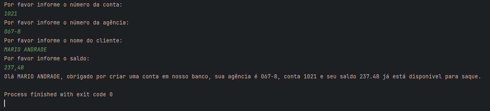

# Desafio trilha java básico - sintaxe

Esse é um repositório para o desafio de sintaxe da trilha java básico da DIO.

Feito usando java 17.

## Como usar:
- Clone esse repositório
- Inicie a aplicação através da classe `Conta Terminal`
- Interaja com a aplicação através do terminal

## Exemplo de saída do terminal: 

